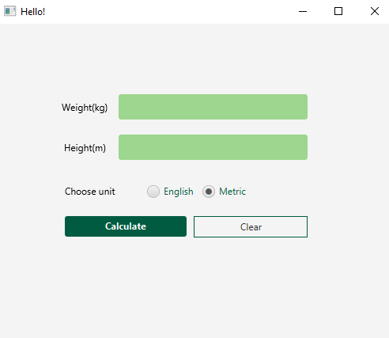

# BMI Calculator JavaFX Application



A simple BMI (Body Mass Index) Calculator application built using Java and JavaFX. This application allows users to calculate their BMI and provides information on their BMI status based on the Department of Health and Human Services/National Institutes of Health guidelines.

## Table of Contents

- [Features](#features)
- [Getting Started](#getting-started)
  - [Prerequisites](#prerequisites)
  - [Installation](#installation)
- [Usage](#usage)
- [Application Screenshots](#application-screenshots)
- [Contributing](#contributing)
- [License](#license)

## Features

- Calculate BMI based on user-provided weight and height.
- Support for both English and metric units.
- Display the calculated BMI and BMI status (Underweight, Normal, Overweight, or Obese).
- User-friendly and intuitive JavaFX interface.
- Clear and exit options in the menu bar.

## Getting Started

### Prerequisites

- Java Development Kit (JDK) compatible with your JavaFX version.
- An integrated development environment (IDE) like IntelliJ IDEA or Eclipse.
- Git (optional) for version control.

### Installation

1. Clone or download the repository to your local machine.

```bash
git clone https://github.com/yourusername/BMICalculator.git
